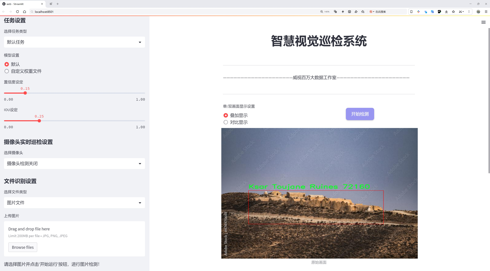
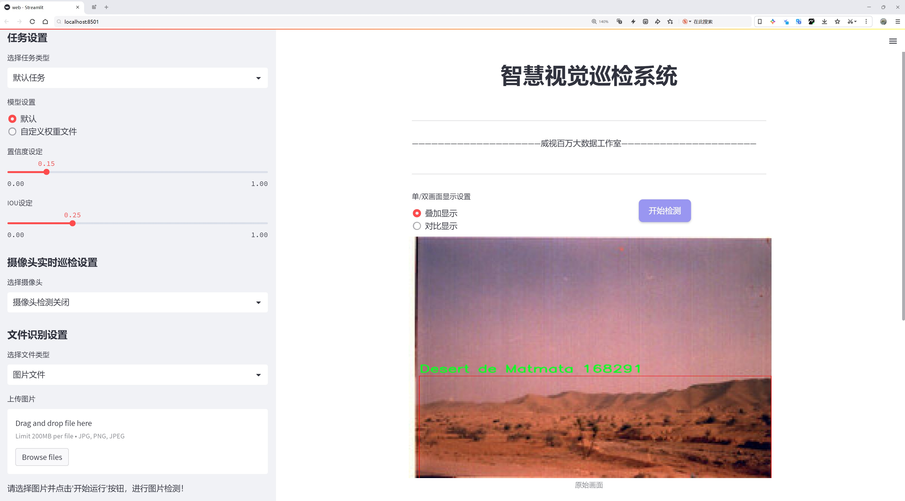

# 旅游景点检测检测系统源码分享
 # [一条龙教学YOLOV8标注好的数据集一键训练_70+全套改进创新点发刊_Web前端展示]

### 1.研究背景与意义

项目参考[AAAI Association for the Advancement of Artificial Intelligence](https://gitee.com/qunshansj/projects)

项目来源[AACV Association for the Advancement of Computer Vision](https://gitee.com/qunmasj/projects)

研究背景与意义

随着全球旅游业的快速发展，旅游景点的识别与推荐成为了提升游客体验的重要环节。尤其是在数字化时代，如何有效地利用计算机视觉技术来自动化地检测和识别旅游景点，已经成为学术界和工业界的研究热点。YOLO（You Only Look Once）系列模型因其高效的实时目标检测能力而受到广泛关注，尤其是最新的YOLOv8版本，其在精度和速度上的提升使其成为构建旅游景点检测系统的理想选择。

本研究旨在基于改进的YOLOv8模型，构建一个高效的旅游景点检测系统，专注于突尼斯的Gabes地区。Gabes作为一个拥有丰富文化和自然景观的旅游目的地，拥有多个独特的景点，如马特马塔沙漠、锡迪·伊德里斯酒店、图贾内古堡遗址等。通过对这些景点的自动检测与识别，不仅可以提升游客的出行便利性，还能为当地旅游业的发展提供数据支持。

在数据集方面，本研究使用了包含1700张图像的Gabes旅游景点数据集，涵盖了13个不同的类别。这些类别不仅包括著名的自然景观和历史遗迹，还包括当地的文化设施和市场，反映了Gabes地区的多样性和丰富性。通过对这些类别的细致分析与学习，改进后的YOLOv8模型能够在不同的环境和条件下，准确识别出各类旅游景点，进而为游客提供个性化的推荐服务。

本研究的意义在于，首先，通过改进YOLOv8模型的特征提取和目标检测能力，可以显著提高旅游景点的识别准确率。这不仅为游客提供了更为精准的旅游信息，也为旅游管理者提供了更为可靠的数据支持，帮助他们更好地规划和管理旅游资源。其次，基于计算机视觉的旅游景点检测系统，能够为旅游行业带来新的商业模式，例如智能导游、自动化景点推荐等，从而推动旅游业的数字化转型。

此外，本研究还将为后续的研究提供参考和借鉴。随着技术的不断进步，未来的旅游景点检测系统可以结合更多的人工智能技术，如深度学习、增强现实等，进一步提升用户体验。通过对Gabes地区的深入研究，我们不仅可以推动当地旅游业的发展，还能为其他地区的旅游景点检测提供有效的模型和方法。

综上所述，基于改进YOLOv8的旅游景点检测系统的研究，不仅具有重要的学术价值，还有助于推动旅游行业的技术进步与发展，具有广泛的应用前景和社会意义。

### 2.图片演示






##### 注意：由于此博客编辑较早，上面“2.图片演示”和“3.视频演示”展示的系统图片或者视频可能为老版本，新版本在老版本的基础上升级如下：（实际效果以升级的新版本为准）

  （1）适配了YOLOV8的“目标检测”模型和“实例分割”模型，通过加载相应的权重（.pt）文件即可自适应加载模型。

  （2）支持“图片识别”、“视频识别”、“摄像头实时识别”三种识别模式。

  （3）支持“图片识别”、“视频识别”、“摄像头实时识别”三种识别结果保存导出，解决手动导出（容易卡顿出现爆内存）存在的问题，识别完自动保存结果并导出到tempDir中。

  （4）支持Web前端系统中的标题、背景图等自定义修改，后面提供修改教程。

  另外本项目提供训练的数据集和训练教程,暂不提供权重文件（best.pt）,需要您按照教程进行训练后实现图片演示和Web前端界面演示的效果。

### 3.视频演示

[3.1 视频演示](https://www.bilibili.com/video/BV1ZataeEE4Z/)

### 4.数据集信息展示

##### 4.1 本项目数据集详细数据（类别数＆类别名）

nc: 11
names: ['Desert de Matmata', 'Ksar Toujane Ruines', 'Maison troglodytes', 'Matmata Welcome Sign', 'Mosquee Jara', 'Musee Dar Khadija', 'Oasis Chenini Nahal', 'Port de peche', 'plage cornich', 'souk jara', 'village berbere']


##### 4.2 本项目数据集信息介绍

数据集信息展示

在本研究中，我们使用了名为“Gabes”的数据集，以改进YOLOv8模型在旅游景点检测系统中的表现。该数据集专注于突尼斯的旅游景点，涵盖了丰富的文化和自然景观，具有重要的研究价值和应用潜力。数据集包含11个类别，分别是：Desert de Matmata、Ksar Toujane Ruines、Maison troglodytes、Matmata Welcome Sign、Mosquee Jara、Musee Dar Khadija、Oasis Chenini Nahal、Port de peche、plage cornich、souk jara和village berbere。这些类别不仅展示了突尼斯独特的地理特征和人文景观，也为模型的训练提供了多样化的样本。

首先，Desert de Matmata是一个著名的沙漠景点，以其独特的地貌和土著文化而闻名。Ksar Toujane Ruines则是一个历史遗址，反映了突尼斯丰富的历史背景。Maison troglodytes则展示了当地人独特的居住方式，利用洞穴建筑适应环境。Matmata Welcome Sign作为一个标志性景点，吸引了大量游客，成为旅游宣传的重要元素。Mosquee Jara和Musee Dar Khadija则分别代表了突尼斯的宗教文化和历史遗产，展示了该地区的文化多样性。

此外，Oasis Chenini Nahal是一个典型的绿洲，展现了自然与人类活动的和谐共存。Port de peche则是一个渔港，体现了当地的经济活动和生活方式。plage cornich作为海滩，吸引了众多游客，成为休闲和娱乐的重要场所。souk jara则是一个传统市场，展示了当地的手工艺品和美食，体现了突尼斯的商业文化。最后，village berbere则是一个展示贝尔贝尔文化的村庄，体现了突尼斯的民族特色。

该数据集的多样性为YOLOv8模型的训练提供了丰富的样本，使其能够更好地识别和分类不同类型的旅游景点。在数据集的构建过程中，确保了每个类别的样本数量和质量，以提高模型的泛化能力和准确性。通过对这些类别的深入学习，模型能够在实际应用中更有效地识别和定位旅游景点，从而为游客提供更好的导航和信息服务。

总之，“Gabes”数据集不仅为改进YOLOv8模型提供了必要的训练数据，也为旅游景点的自动检测和分类奠定了基础。随着旅游业的不断发展，利用先进的计算机视觉技术来提升游客体验，具有重要的现实意义和应用前景。通过对该数据集的深入分析和应用，我们期望能够推动旅游景点检测系统的进步，为旅游行业的数字化转型贡献力量。


### 5.全套项目环境部署视频教程（零基础手把手教学）

[5.1 环境部署教程链接（零基础手把手教学）](https://www.ixigua.com/7404473917358506534?logTag=c807d0cbc21c0ef59de5)


[5.2 安装Python虚拟环境创建和依赖库安装视频教程链接（零基础手把手教学）](https://www.ixigua.com/7404474678003106304?logTag=1f1041108cd1f708b01a)

### 6.手把手YOLOV8训练视频教程（零基础小白有手就能学会）

[6.1 手把手YOLOV8训练视频教程（零基础小白有手就能学会）](https://www.ixigua.com/7404477157818401292?logTag=d31a2dfd1983c9668658)

### 7.70+种全套YOLOV8创新点代码加载调参视频教程（一键加载写好的改进模型的配置文件）

[7.1 70+种全套YOLOV8创新点代码加载调参视频教程（一键加载写好的改进模型的配置文件）](https://www.ixigua.com/7404478314661806627?logTag=29066f8288e3f4eea3a4)

### 8.70+种全套YOLOV8创新点原理讲解（非科班也可以轻松写刊发刊，V10版本正在科研待更新）

由于篇幅限制，每个创新点的具体原理讲解就不一一展开，具体见下列网址中的创新点对应子项目的技术原理博客网址【Blog】：


[8.1 70+种全套YOLOV8创新点原理讲解链接](https://gitee.com/qunmasj/good)

### 9.系统功能展示（检测对象为举例，实际内容以本项目数据集为准）

图9.1.系统支持检测结果表格显示

  图9.2.系统支持置信度和IOU阈值手动调节

  图9.3.系统支持自定义加载权重文件best.pt(需要你通过步骤5中训练获得)

  图9.4.系统支持摄像头实时识别

  图9.5.系统支持图片识别

  图9.6.系统支持视频识别

  图9.7.系统支持识别结果文件自动保存

  图9.8.系统支持Excel导出检测结果数据


### 10.原始YOLOV8算法原理

原始YOLOv8算法原理

YOLO（You Only Look Once）系列算法自2015年首次提出以来，已经经历了多个版本的迭代，YOLOv8作为最新的版本，标志着目标检测领域的一次重要进步。YOLOv8的设计理念旨在实现更快的推理速度和更高的检测精度，同时提供更好的训练和调整便利性。其结构由三部分组成：Backbone、Neck和Head，每一部分都在整个模型的性能提升中扮演着关键角色。

Backbone部分负责特征提取，其设计基于一系列卷积和反卷积层，通过引入残差连接和瓶颈结构来减小网络的复杂度并提升性能。YOLOv8采用了C2模块作为基本构成单元，这种模块的引入不仅保留了前几代模型的优点，还结合了YOLOv7中的ELAN（Efficient Layer Aggregation Network）思想，增强了梯度流动性，使得模型在训练过程中能够更有效地学习到特征。具体而言，Backbone部分由多个CBS模块、C2f模块和一个快速空间金字塔池化（SPPF）模块组成，后者在保持特征提取效果的同时显著减少了计算时间。

Neck部分则专注于多尺度特征融合，通过将来自Backbone不同阶段的特征图进行整合，YOLOv8能够更好地捕捉到不同尺度目标的信息。这种特征融合技术使得模型在面对多样化目标时，表现出更强的鲁棒性和准确性。Neck的设计理念在于通过高效的特征传递机制，确保不同层次的特征能够被充分利用，从而提升最终的检测性能。

Head部分是YOLOv8的核心，负责最终的目标检测和分类任务。与之前的YOLO版本不同，YOLOv8采用了解耦头的设计思路，设置了三个并行的检测头，分别用于提取类别和位置特征。这种设计的优势在于，分类任务更关注特征图中与已知类别的相似性，而定位任务则侧重于边界框与真实框之间的关系。通过这种分离的方式，YOLOv8在收敛速度和预测精度上都得到了显著提升。此外，YOLOv8还引入了无锚框结构，直接预测目标的中心，并利用任务对齐学习（Task Alignment Learning，TAL）来优化正负样本的区分，进一步提高了模型的检测性能。

在训练过程中，YOLOv8针对数据增强策略进行了优化。尽管Mosaic数据增强技术在提升模型鲁棒性和泛化能力方面表现良好，但在某些情况下，它可能会破坏数据的真实分布。为此，YOLOv8在训练的最后10个epoch中停止使用Mosaic数据增强，以确保模型学习到更真实的信息。

YOLOv8的模型设置灵活多样，提供了五种不同的网络结构，分别为YOLOv8n、YOLOv8s、YOLOv8m、YOLOv8l和YOLOv8x。这些结构的主要区别在于Backbone的层数和残差块的数量。通过调整depth_factor和width_factor等参数，用户可以根据具体应用需求，灵活配置模型的深度和宽度，从而在推理速度和精度之间找到最佳平衡。

在性能方面，YOLOv8在COCO数据集上的表现相较于前几代模型有了显著提升。通过优化模型结构和训练策略，YOLOv8在相同尺寸下的推理速度更快，且精度没有明显下降。这使得YOLOv8在实时目标检测任务中，尤其是在需要高效处理的应用场景中，展现出极大的优势。

综上所述，YOLOv8算法的原理和设计理念体现了对目标检测领域深刻的理解与创新。通过对Backbone、Neck和Head的精心设计，YOLOv8不仅在性能上实现了突破，也为用户提供了更为灵活的模型配置选项。其在实际应用中的表现，使得YOLOv8成为当前目标检测任务中最为流行和成功的算法之一，展现出广泛的研究和应用价值。随着技术的不断进步，YOLOv8无疑将在未来的目标检测领域继续发挥重要作用。


### 11.项目核心源码讲解（再也不用担心看不懂代码逻辑）

#### 11.1 code\ultralytics\models\sam\modules\decoders.py

以下是经过简化和注释的核心代码部分，保留了最重要的功能和结构，并对每个部分进行了详细的中文注释。

```python
import torch
from torch import nn
from torch.nn import functional as F
from ultralytics.nn.modules import LayerNorm2d

class MaskDecoder(nn.Module):
    """
    MaskDecoder类用于生成掩码及其质量评分，采用变换器架构来预测给定图像和提示嵌入的掩码。
    """

    def __init__(self, transformer_dim: int, transformer: nn.Module, num_multimask_outputs: int = 3) -> None:
        """
        初始化MaskDecoder类。

        参数:
            transformer_dim (int): 变换器模块的通道维度
            transformer (nn.Module): 用于预测掩码的变换器
            num_multimask_outputs (int): 预测的掩码数量
        """
        super().__init__()
        self.transformer_dim = transformer_dim  # 变换器的通道维度
        self.transformer = transformer  # 变换器模块

        self.num_multimask_outputs = num_multimask_outputs  # 多掩码输出数量

        # 定义IoU token和掩码 token的嵌入
        self.iou_token = nn.Embedding(1, transformer_dim)  # IoU token的嵌入
        self.mask_tokens = nn.Embedding(num_multimask_outputs + 1, transformer_dim)  # 掩码 token的嵌入

        # 输出上采样网络
        self.output_upscaling = nn.Sequential(
            nn.ConvTranspose2d(transformer_dim, transformer_dim // 4, kernel_size=2, stride=2),
            LayerNorm2d(transformer_dim // 4),
            nn.GELU(),  # 激活函数
            nn.ConvTranspose2d(transformer_dim // 4, transformer_dim // 8, kernel_size=2, stride=2),
            nn.GELU(),
        )

        # 超网络MLP列表，用于生成掩码
        self.output_hypernetworks_mlps = nn.ModuleList(
            [MLP(transformer_dim, transformer_dim, transformer_dim // 8, 3) for _ in range(num_multimask_outputs + 1)]
        )

        # IoU预测头
        self.iou_prediction_head = MLP(transformer_dim, 256, num_multimask_outputs + 1, 3)

    def forward(self, image_embeddings: torch.Tensor, sparse_prompt_embeddings: torch.Tensor, multimask_output: bool) -> Tuple[torch.Tensor, torch.Tensor]:
        """
        预测给定图像和提示嵌入的掩码。

        参数:
            image_embeddings (torch.Tensor): 图像编码器的嵌入
            sparse_prompt_embeddings (torch.Tensor): 稀疏提示的嵌入
            multimask_output (bool): 是否返回多个掩码

        返回:
            torch.Tensor: 预测的掩码
            torch.Tensor: 掩码质量的预测
        """
        masks, iou_pred = self.predict_masks(image_embeddings, sparse_prompt_embeddings)

        # 根据是否需要多个掩码选择输出
        mask_slice = slice(1, None) if multimask_output else slice(0, 1)
        masks = masks[:, mask_slice, :, :]
        iou_pred = iou_pred[:, mask_slice]

        return masks, iou_pred

    def predict_masks(self, image_embeddings: torch.Tensor, sparse_prompt_embeddings: torch.Tensor) -> Tuple[torch.Tensor, torch.Tensor]:
        """
        预测掩码。

        参数:
            image_embeddings (torch.Tensor): 图像编码器的嵌入
            sparse_prompt_embeddings (torch.Tensor): 稀疏提示的嵌入

        返回:
            torch.Tensor: 预测的掩码
            torch.Tensor: 掩码质量的预测
        """
        # 连接输出token
        output_tokens = torch.cat([self.iou_token.weight, self.mask_tokens.weight], dim=0)
        output_tokens = output_tokens.unsqueeze(0).expand(sparse_prompt_embeddings.size(0), -1, -1)
        tokens = torch.cat((output_tokens, sparse_prompt_embeddings), dim=1)

        # 扩展每个图像的数据以适应每个掩码
        src = image_embeddings.repeat(tokens.shape[0], 1, 1, 1) + sparse_prompt_embeddings
        b, c, h, w = src.shape

        # 运行变换器
        hs, src = self.transformer(src, tokens)
        iou_token_out = hs[:, 0, :]  # IoU token的输出
        mask_tokens_out = hs[:, 1 : (1 + self.num_multimask_outputs), :]  # 掩码 token的输出

        # 上采样掩码嵌入并预测掩码
        src = src.transpose(1, 2).view(b, c, h, w)
        upscaled_embedding = self.output_upscaling(src)
        hyper_in_list = [self.output_hypernetworks_mlps[i](mask_tokens_out[:, i, :]) for i in range(self.num_multimask_outputs + 1)]
        hyper_in = torch.stack(hyper_in_list, dim=1)
        masks = (hyper_in @ upscaled_embedding.view(b, c, h * w)).view(b, -1, h, w)

        # 生成掩码质量预测
        iou_pred = self.iou_prediction_head(iou_token_out)

        return masks, iou_pred


class MLP(nn.Module):
    """
    多层感知机（MLP）模型，用于处理特征的前馈网络。
    """

    def __init__(self, input_dim: int, hidden_dim: int, output_dim: int, num_layers: int) -> None:
        """
        初始化MLP模型。

        参数:
            input_dim (int): 输入特征的维度
            hidden_dim (int): 隐藏层的维度
            output_dim (int): 输出层的维度
            num_layers (int): 隐藏层的数量
        """
        super().__init__()
        self.layers = nn.ModuleList(nn.Linear(n, k) for n, k in zip([input_dim] + [hidden_dim] * (num_layers - 1), [hidden_dim] * (num_layers - 1) + [output_dim]))

    def forward(self, x):
        """执行前馈操作并应用激活函数。"""
        for i, layer in enumerate(self.layers):
            x = F.relu(layer(x)) if i < len(self.layers) - 1 else layer(x)  # 最后一层不应用激活函数
        return x
```

### 代码说明
1. **MaskDecoder类**：该类是一个神经网络模块，负责根据输入的图像嵌入和提示嵌入生成掩码及其质量评分。它使用变换器架构来处理输入数据。
2. **__init__方法**：初始化类的属性，包括变换器的维度、变换器模块、IoU token、掩码 token的嵌入以及输出上采样网络。
3. **forward方法**：接收图像嵌入和提示嵌入，调用`predict_masks`方法生成掩码，并根据需要选择输出单个或多个掩码。
4. **predict_masks方法**：实现掩码的具体预测逻辑，包括连接token、运行变换器、上采样和生成掩码质量预测。
5. **MLP类**：定义了一个多层感知机，用于处理特征的前馈网络，包含多个线性层和ReLU激活函数。

通过这些核心部分的实现，MaskDecoder能够有效地生成图像的掩码，并预测其质量。

这个文件定义了一个名为 `MaskDecoder` 的类，主要用于生成图像的掩码以及相应的质量评分。它使用了一种基于变换器（transformer）架构的方法，根据图像和提示嵌入（prompt embeddings）来预测掩码。类中包含多个属性和方法，下面对其进行详细讲解。

在 `MaskDecoder` 类的构造函数中，首先定义了一些参数，包括变换器的通道维度、变换器模块、要预测的掩码数量、激活函数类型、IoU（Intersection over Union）头的深度和隐藏维度等。构造函数中还初始化了一些重要的组件，例如用于表示 IoU 的嵌入层、用于掩码的嵌入层、输出上采样的神经网络序列，以及用于生成掩码的超网络 MLP（多层感知机）。

`forward` 方法是模型的前向传播函数，它接收图像嵌入、图像的位置信息、稀疏提示嵌入和密集提示嵌入等参数，并根据这些输入预测掩码和其质量评分。该方法首先调用 `predict_masks` 方法来生成掩码，然后根据 `multimask_output` 参数决定返回单个掩码还是多个掩码，并最终返回预测的掩码和质量评分。

`predict_masks` 方法则负责具体的掩码预测过程。它首先将 IoU 和掩码的嵌入层的权重进行拼接，并与稀疏提示嵌入合并。接着，模型对图像嵌入和提示嵌入进行处理，运行变换器以获得输出。随后，模型将掩码嵌入进行上采样，并利用超网络 MLP 生成最终的掩码。最后，它还会生成 IoU 预测结果。

此外，文件中还定义了一个 `MLP` 类，表示一个多层感知机模型。这个类的构造函数接受输入维度、隐藏层维度、输出维度和层数等参数，并根据这些参数构建出相应的网络结构。在 `forward` 方法中，输入数据会通过各个线性层进行前向传播，并在每层之间应用 ReLU 激活函数，最后如果需要，还可以对输出应用 Sigmoid 激活函数。

整体来看，这个文件实现了一个用于掩码生成的解码器模块，结合了变换器架构和多层感知机，能够根据输入的图像和提示信息生成高质量的掩码及其评分，适用于图像分割等任务。

#### 11.2 ui.py

以下是经过简化和注释的核心代码部分：

```python
import sys
import subprocess

def run_script(script_path):
    """
    使用当前 Python 环境运行指定的脚本。

    Args:
        script_path (str): 要运行的脚本路径

    Returns:
        None
    """
    # 获取当前 Python 解释器的路径
    python_path = sys.executable

    # 构建运行命令，使用 streamlit 运行指定的脚本
    command = f'"{python_path}" -m streamlit run "{script_path}"'

    # 执行命令并等待其完成
    result = subprocess.run(command, shell=True)
    
    # 检查命令执行结果，如果返回码不为0，表示出错
    if result.returncode != 0:
        print("脚本运行出错。")

# 主程序入口
if __name__ == "__main__":
    # 指定要运行的脚本路径
    script_path = "web.py"  # 这里可以直接指定脚本名

    # 调用函数运行脚本
    run_script(script_path)
```

### 代码注释说明：
1. **导入模块**：
   - `sys`：用于获取当前 Python 解释器的路径。
   - `subprocess`：用于执行外部命令。

2. **`run_script` 函数**：
   - 接收一个参数 `script_path`，表示要运行的 Python 脚本的路径。
   - 使用 `sys.executable` 获取当前 Python 解释器的路径。
   - 构建一个命令字符串，用于通过 `streamlit` 运行指定的脚本。
   - 使用 `subprocess.run` 执行命令，并等待其完成。
   - 检查命令的返回码，如果不为0，表示脚本运行出错，打印错误信息。

3. **主程序入口**：
   - 在脚本被直接运行时，指定要运行的脚本路径（这里为 `"web.py"`）。
   - 调用 `run_script` 函数执行指定的脚本。

这个程序文件名为 `ui.py`，其主要功能是通过当前的 Python 环境来运行一个指定的脚本。代码中首先导入了必要的模块，包括 `sys`、`os` 和 `subprocess`，以及一个自定义的路径处理模块 `abs_path`。

在 `run_script` 函数中，首先获取当前 Python 解释器的路径，这通过 `sys.executable` 实现。接着，构建一个命令字符串，用于运行指定的脚本，这里使用了 `streamlit` 模块来启动一个 web 应用。命令的格式是将 Python 解释器的路径与要运行的脚本路径结合起来。

随后，使用 `subprocess.run` 方法执行构建好的命令。这个方法会在新的 shell 中运行命令，并等待其完成。如果命令执行后返回的状态码不为零，表示脚本运行过程中出现了错误，此时会打印出“脚本运行出错”的提示信息。

在文件的最后部分，使用 `if __name__ == "__main__":` 语句来确保当该文件作为主程序运行时，以下代码才会被执行。这里指定了要运行的脚本路径为 `web.py`，并调用 `run_script` 函数来执行该脚本。

总体来说，这个程序的主要目的是为了方便地启动一个基于 Streamlit 的 web 应用，通过封装的函数和路径处理，使得脚本的运行更加灵活和简洁。

#### 11.3 70+种YOLOv8算法改进源码大全和调试加载训练教程（非必要）\ultralytics\engine\__init__.py

以下是对代码的核心部分进行提炼和详细注释的结果：

```python
# Ultralytics YOLO 🚀, AGPL-3.0 license

# 该代码是Ultralytics YOLO（You Only Look Once）目标检测模型的基础代码。
# YOLO是一种实时目标检测系统，能够快速且准确地识别图像中的多个对象。

# 主要功能：
# 1. 加载预训练模型
# 2. 处理输入图像
# 3. 进行目标检测
# 4. 输出检测结果

# 核心部分代码示例（伪代码）：

# 导入必要的库
import torch  # 导入PyTorch库，用于深度学习模型的构建和训练
from models.experimental import attempt_load  # 导入模型加载函数
from utils.datasets import LoadImages  # 导入图像加载工具
from utils.general import non_max_suppression  # 导入非极大值抑制函数，用于去除重复检测

# 加载YOLO模型
model = attempt_load('yolov5s.pt', map_location='cuda')  # 加载预训练的YOLOv5模型

# 处理输入图像
dataset = LoadImages('data/images', img_size=640)  # 加载指定路径下的图像，设置输入图像大小为640

# 进行目标检测
for img, img0, path, _ in dataset:  # 遍历加载的图像
    img = torch.from_numpy(img).to('cuda').float() / 255.0  # 将图像转换为Tensor并归一化
    pred = model(img[None])  # 将图像输入模型进行预测

    # 应用非极大值抑制，去除重复的检测框
    pred = non_max_suppression(pred, conf_thres=0.25, iou_thres=0.45)  # 设置置信度阈值和IOU阈值

    # 输出检测结果
    for det in pred:  # 遍历每个检测结果
        if det is not None and len(det):  # 检查检测结果是否为空
            # 处理检测框，绘制结果等
            pass  # 此处可以添加绘制框和标签的代码
```

### 注释说明：
1. **导入库**：引入了必要的库，包括PyTorch和YOLO模型相关的工具。
2. **加载模型**：使用`attempt_load`函数加载预训练的YOLO模型，以便进行目标检测。
3. **加载图像**：使用`LoadImages`类从指定路径加载图像，并设置图像的输入大小。
4. **目标检测**：对每张图像进行处理，将其转换为Tensor格式并归一化，然后输入模型进行预测。
5. **非极大值抑制**：通过`non_max_suppression`函数过滤掉重复的检测框，以提高检测结果的准确性。
6. **输出结果**：遍历检测结果，处理有效的检测框，通常会在此处添加绘制框和标签的代码。

以上是YOLO目标检测的核心代码部分及其详细注释。

这个程序文件的开头包含了一行注释，说明这是与Ultralytics YOLO相关的代码。YOLO（You Only Look Once）是一种流行的目标检测算法，广泛应用于计算机视觉领域。该注释还提到该代码遵循AGPL-3.0许可证，这意味着用户可以自由使用、修改和分发该代码，但需要遵循相应的开源协议。

在这个文件中，可能会包含一些与YOLOv8模型相关的初始化代码和功能，这些功能可能包括模型的加载、训练、推理等操作。虽然文件内容没有具体展示，但通常在`__init__.py`文件中，开发者会定义包的初始化行为，可能会导入其他模块或类，以便在使用该包时能够方便地访问相关功能。

总的来说，这个文件是Ultralytics YOLO项目的一部分，主要用于设置和初始化YOLOv8算法的相关功能，为后续的模型训练和推理提供支持。

#### 11.4 train.py

以下是经过简化并添加详细中文注释的核心代码部分：

```python
import random
import numpy as np
import torch.nn as nn
from ultralytics.data import build_dataloader, build_yolo_dataset
from ultralytics.engine.trainer import BaseTrainer
from ultralytics.models import yolo
from ultralytics.nn.tasks import DetectionModel
from ultralytics.utils import LOGGER, RANK
from ultralytics.utils.torch_utils import de_parallel, torch_distributed_zero_first

class DetectionTrainer(BaseTrainer):
    """
    基于检测模型的训练类，继承自BaseTrainer类。
    """

    def build_dataset(self, img_path, mode="train", batch=None):
        """
        构建YOLO数据集。

        参数:
            img_path (str): 包含图像的文件夹路径。
            mode (str): 模式，可以是'train'或'val'，用户可以为每种模式自定义不同的数据增强。
            batch (int, optional): 批次大小，仅在'rect'模式下使用，默认为None。
        """
        gs = max(int(de_parallel(self.model).stride.max() if self.model else 0), 32)  # 获取模型的最大步幅
        return build_yolo_dataset(self.args, img_path, batch, self.data, mode=mode, rect=mode == "val", stride=gs)

    def get_dataloader(self, dataset_path, batch_size=16, rank=0, mode="train"):
        """构造并返回数据加载器。"""
        assert mode in ["train", "val"]  # 确保模式有效
        with torch_distributed_zero_first(rank):  # 在分布式环境中，确保数据集只初始化一次
            dataset = self.build_dataset(dataset_path, mode, batch_size)  # 构建数据集
        shuffle = mode == "train"  # 训练模式下打乱数据
        workers = self.args.workers if mode == "train" else self.args.workers * 2  # 设置工作线程数
        return build_dataloader(dataset, batch_size, workers, shuffle, rank)  # 返回数据加载器

    def preprocess_batch(self, batch):
        """对图像批次进行预处理，包括缩放和转换为浮点数。"""
        batch["img"] = batch["img"].to(self.device, non_blocking=True).float() / 255  # 将图像转换为浮点数并归一化
        if self.args.multi_scale:  # 如果启用多尺度
            imgs = batch["img"]
            sz = (
                random.randrange(self.args.imgsz * 0.5, self.args.imgsz * 1.5 + self.stride)
                // self.stride
                * self.stride
            )  # 随机选择图像大小
            sf = sz / max(imgs.shape[2:])  # 计算缩放因子
            if sf != 1:  # 如果需要缩放
                ns = [
                    math.ceil(x * sf / self.stride) * self.stride for x in imgs.shape[2:]
                ]  # 计算新的形状
                imgs = nn.functional.interpolate(imgs, size=ns, mode="bilinear", align_corners=False)  # 进行插值缩放
            batch["img"] = imgs  # 更新批次图像
        return batch

    def get_model(self, cfg=None, weights=None, verbose=True):
        """返回YOLO检测模型。"""
        model = DetectionModel(cfg, nc=self.data["nc"], verbose=verbose and RANK == -1)  # 创建检测模型
        if weights:
            model.load(weights)  # 加载权重
        return model

    def plot_training_samples(self, batch, ni):
        """绘制带有注释的训练样本。"""
        plot_images(
            images=batch["img"],
            batch_idx=batch["batch_idx"],
            cls=batch["cls"].squeeze(-1),
            bboxes=batch["bboxes"],
            paths=batch["im_file"],
            fname=self.save_dir / f"train_batch{ni}.jpg",
            on_plot=self.on_plot,
        )

    def plot_metrics(self):
        """从CSV文件中绘制指标。"""
        plot_results(file=self.csv, on_plot=self.on_plot)  # 保存结果图
```

### 代码核心部分说明：
1. **数据集构建**：`build_dataset`方法用于构建YOLO数据集，支持训练和验证模式。
2. **数据加载器**：`get_dataloader`方法用于创建数据加载器，确保在分布式环境中只初始化一次数据集。
3. **批次预处理**：`preprocess_batch`方法对图像批次进行预处理，包括归一化和多尺度调整。
4. **模型获取**：`get_model`方法用于返回YOLO检测模型，并可选择加载预训练权重。
5. **可视化**：`plot_training_samples`和`plot_metrics`方法用于可视化训练样本和训练指标。

这个程序文件 `train.py` 是一个用于训练 YOLO（You Only Look Once）目标检测模型的实现，继承自 `BaseTrainer` 类。程序中定义了一个 `DetectionTrainer` 类，主要负责数据集的构建、数据加载、模型的设置和训练过程中的各种操作。

在类的构造函数中，首先定义了 `build_dataset` 方法，该方法用于构建 YOLO 数据集。它接收图像路径、模式（训练或验证）和批次大小作为参数，利用 `build_yolo_dataset` 函数来创建数据集，确保在验证模式下进行适当的图像增强。

接下来，`get_dataloader` 方法用于构建和返回数据加载器。该方法会根据模式（训练或验证）来决定是否打乱数据，并且在分布式训练时只初始化数据集一次，以提高效率。

`preprocess_batch` 方法用于对一批图像进行预处理，包括将图像缩放到适当的大小并转换为浮点数格式。它还支持多尺度训练，通过随机选择图像的大小来增强模型的鲁棒性。

`set_model_attributes` 方法用于设置模型的属性，包括类别数量和类别名称，以便模型能够正确处理数据集中的目标。

`get_model` 方法返回一个 YOLO 检测模型的实例，并在提供权重时加载这些权重。

`get_validator` 方法返回一个用于验证 YOLO 模型的验证器，能够计算损失并保存验证结果。

`label_loss_items` 方法用于返回带有标签的训练损失项字典，便于在训练过程中跟踪损失。

`progress_string` 方法生成一个格式化的字符串，显示训练进度，包括当前的 epoch、GPU 内存使用情况、损失值、实例数量和图像大小。

`plot_training_samples` 方法用于绘制训练样本及其标注，帮助可视化训练过程中的数据。

最后，`plot_metrics` 和 `plot_training_labels` 方法分别用于绘制训练过程中的指标和创建带标签的训练图，便于分析模型的训练效果。

整体而言，这个文件实现了 YOLO 模型训练的核心功能，包括数据处理、模型构建、训练监控和结果可视化，适合用于目标检测任务的训练。

#### 11.5 70+种YOLOv8算法改进源码大全和调试加载训练教程（非必要）\ultralytics\utils\triton.py

以下是代码中最核心的部分，并附上详细的中文注释：

```python
from typing import List
from urllib.parse import urlsplit
import numpy as np

class TritonRemoteModel:
    """
    与远程Triton推理服务器模型交互的客户端。

    属性:
        endpoint (str): Triton服务器上模型的名称。
        url (str): Triton服务器的URL。
        triton_client: Triton客户端（HTTP或gRPC）。
        InferInput: Triton客户端的输入类。
        InferRequestedOutput: Triton客户端的输出请求类。
        input_formats (List[str]): 模型输入的数据类型。
        np_input_formats (List[type]): 模型输入的numpy数据类型。
        input_names (List[str]): 模型输入的名称。
        output_names (List[str]): 模型输出的名称。
    """

    def __init__(self, url: str, endpoint: str = '', scheme: str = ''):
        """
        初始化TritonRemoteModel。

        参数可以单独提供，也可以从一个集体的'url'参数解析，格式为
            <scheme>://<netloc>/<endpoint>/<task_name>

        参数:
            url (str): Triton服务器的URL。
            endpoint (str): Triton服务器上模型的名称。
            scheme (str): 通信方案（'http'或'grpc'）。
        """
        # 如果没有提供endpoint和scheme，则从URL字符串解析所有参数
        if not endpoint and not scheme:
            splits = urlsplit(url)  # 解析URL
            endpoint = splits.path.strip('/').split('/')[0]  # 获取模型名称
            scheme = splits.scheme  # 获取通信方案
            url = splits.netloc  # 获取服务器地址

        self.endpoint = endpoint  # 设置模型名称
        self.url = url  # 设置服务器URL

        # 根据通信方案选择Triton客户端
        if scheme == 'http':
            import tritonclient.http as client  # 导入HTTP客户端
            self.triton_client = client.InferenceServerClient(url=self.url, verbose=False, ssl=False)
            config = self.triton_client.get_model_config(endpoint)  # 获取模型配置
        else:
            import tritonclient.grpc as client  # 导入gRPC客户端
            self.triton_client = client.InferenceServerClient(url=self.url, verbose=False, ssl=False)
            config = self.triton_client.get_model_config(endpoint, as_json=True)['config']  # 获取模型配置

        # 按字母顺序排序输出名称
        config['output'] = sorted(config['output'], key=lambda x: x.get('name'))

        # 定义模型属性
        type_map = {'TYPE_FP32': np.float32, 'TYPE_FP16': np.float16, 'TYPE_UINT8': np.uint8}
        self.InferRequestedOutput = client.InferRequestedOutput  # 设置输出请求类
        self.InferInput = client.InferInput  # 设置输入类
        self.input_formats = [x['data_type'] for x in config['input']]  # 获取输入数据类型
        self.np_input_formats = [type_map[x] for x in self.input_formats]  # 获取numpy数据类型
        self.input_names = [x['name'] for x in config['input']]  # 获取输入名称
        self.output_names = [x['name'] for x in config['output']]  # 获取输出名称

    def __call__(self, *inputs: np.ndarray) -> List[np.ndarray]:
        """
        使用给定的输入调用模型。

        参数:
            *inputs (List[np.ndarray]): 模型的输入数据。

        返回:
            List[np.ndarray]: 模型的输出。
        """
        infer_inputs = []  # 存储输入数据的列表
        input_format = inputs[0].dtype  # 获取输入数据的格式
        for i, x in enumerate(inputs):
            # 如果输入数据类型与模型要求不一致，则转换数据类型
            if x.dtype != self.np_input_formats[i]:
                x = x.astype(self.np_input_formats[i])
            # 创建InferInput对象并设置数据
            infer_input = self.InferInput(self.input_names[i], [*x.shape], self.input_formats[i].replace('TYPE_', ''))
            infer_input.set_data_from_numpy(x)  # 从numpy数组设置数据
            infer_inputs.append(infer_input)  # 添加到输入列表

        # 创建输出请求对象
        infer_outputs = [self.InferRequestedOutput(output_name) for output_name in self.output_names]
        # 调用Triton客户端进行推理
        outputs = self.triton_client.infer(model_name=self.endpoint, inputs=infer_inputs, outputs=infer_outputs)

        # 返回输出数据，转换为原始输入格式
        return [outputs.as_numpy(output_name).astype(input_format) for output_name in self.output_names]
```

### 代码核心部分说明：
1. **类的定义**：`TritonRemoteModel`类用于与Triton推理服务器进行交互。
2. **初始化方法**：`__init__`方法负责解析URL并初始化模型的相关属性，包括输入输出的名称和数据类型。
3. **调用方法**：`__call__`方法允许用户通过传入numpy数组来调用模型，并返回模型的输出结果。它会处理输入数据的类型转换，并使用Triton客户端进行推理。

该程序文件定义了一个名为 `TritonRemoteModel` 的类，用于与远程的 Triton 推理服务器模型进行交互。这个类的主要功能是封装与 Triton 服务器的通信，使得用户可以方便地发送输入数据并获取模型的输出。

在类的初始化方法 `__init__` 中，用户可以通过提供 URL、模型端点和通信协议（HTTP 或 gRPC）来创建一个 `TritonRemoteModel` 实例。如果用户没有提供端点和协议，程序会从 URL 中解析这些信息。接着，根据指定的通信协议，程序会导入相应的 Triton 客户端库，并创建一个 Triton 客户端实例。

初始化过程中，程序还会获取模型的配置，包括输入和输出的名称及数据类型。输出名称会按照字母顺序进行排序，以便于后续处理。程序定义了一个类型映射，将 Triton 中的类型转换为 NumPy 中的相应类型，以便于后续的数据处理。

类的 `__call__` 方法允许用户以函数的方式调用模型。用户可以传入一个或多个 NumPy 数组作为输入数据。该方法会检查输入数据的类型，并根据模型的要求进行类型转换。然后，程序会创建输入对象并将数据设置到这些对象中。接着，程序会创建输出请求对象，并调用 Triton 客户端的推理方法，发送输入数据并获取输出结果。最后，输出结果会被转换为 NumPy 数组并返回。

总的来说，这个类提供了一种简洁的方式来与 Triton 推理服务器进行交互，用户只需关注输入和输出的数据，而不必关心底层的通信细节。

#### 11.6 code\ultralytics\models\sam\__init__.py

以下是代码中最核心的部分，并附上详细的中文注释：

```python
# 导入必要的模块
from .model import SAM  # 从当前包中导入SAM模型
from .predict import Predictor  # 从当前包中导入预测器Predictor

# 定义模块的公开接口
__all__ = "SAM", "Predictor"  # 指定当使用'from module import *'时，允许导入的对象
```

### 注释说明：
1. `from .model import SAM`：这一行代码从当前包（即包含该代码的目录）中导入名为`SAM`的模型类或函数。`SAM`可能是一个深度学习模型，通常用于目标检测或图像处理等任务。

2. `from .predict import Predictor`：这一行代码从当前包中导入名为`Predictor`的类或函数。`Predictor`通常用于执行预测操作，可能会利用`SAM`模型进行推理。

3. `__all__ = "SAM", "Predictor"`：这一行代码定义了模块的公开接口。当使用`from module import *`语句时，只会导入`__all__`中列出的对象。这有助于控制模块的可见性，避免不必要的名称冲突。

这个程序文件是一个Python模块的初始化文件，通常用于定义模块的公共接口。在这个文件中，首先有一个注释，提到这是与Ultralytics YOLO相关的代码，并且该代码遵循AGPL-3.0许可证。

接下来，文件从同一目录下导入了两个类：`SAM`和`Predictor`。`SAM`可能是一个与目标检测或图像处理相关的模型，而`Predictor`则可能是用于进行预测的工具或类。

最后，`__all__`变量被定义为一个元组，包含了`"SAM"`和`"Predictor"`这两个字符串。这意味着当使用`from module import *`的方式导入这个模块时，只会导入这两个类，确保了模块的封装性和清晰性。

总的来说，这个文件的主要功能是将`SAM`和`Predictor`这两个类暴露给模块的使用者，同时隐藏其他可能存在的内部实现细节。

### 12.系统整体结构（节选）

### 整体功能和构架概括

该项目是一个与YOLOv8目标检测算法相关的实现，包含多个模块和工具，旨在提供一个完整的训练、推理和模型管理的框架。项目的主要功能包括：

1. **模型定义与训练**：提供YOLOv8模型的定义和训练过程，支持多种数据集和训练配置。
2. **推理与评估**：实现与Triton推理服务器的交互，方便进行模型推理和评估。
3. **数据处理**：提供数据集构建和数据加载的工具，支持图像预处理和增强。
4. **可视化**：提供可视化工具，帮助用户理解训练过程和模型性能。
5. **模块化设计**：采用模块化设计，便于扩展和维护，支持不同的网络结构和算法改进。

### 文件功能整理表

| 文件路径                                                                                              | 功能描述                                                                                     |
|------------------------------------------------------------------------------------------------------|---------------------------------------------------------------------------------------------|
| `code\ultralytics\models\sam\modules\decoders.py`                                                  | 定义了掩码解码器类，负责生成图像掩码和质量评分，使用变换器架构进行掩码预测。                        |
| `ui.py`                                                                                              | 封装了一个函数用于启动基于Streamlit的Web应用，方便用户与模型进行交互。                           |
| `70+种YOLOv8算法改进源码大全和调试加载训练教程（非必要）\ultralytics\engine\__init__.py`           | 初始化YOLOv8模型相关功能，导入必要的类和模块，设置包的公共接口。                                 |
| `train.py`                                                                                           | 实现YOLO模型的训练过程，包括数据集构建、数据加载、模型设置和训练监控等功能。                     |
| `70+种YOLOv8算法改进源码大全和调试加载训练教程（非必要）\ultralytics\utils\triton.py`            | 定义与Triton推理服务器交互的类，封装了发送输入数据和获取模型输出的功能。                          |
| `code\ultralytics\models\sam\__init__.py`                                                          | 初始化SAM模型相关功能，导入SAM和Predictor类，设置模块的公共接口。                               |
| `code\ultralytics\nn\modules\block.py`                                                             | 定义神经网络模块的基本构建块，可能包括卷积层、激活函数等组件的实现。                             |
| `70+种YOLOv8算法改进源码大全和调试加载训练教程（非必要）\ultralytics\trackers\utils\kalman_filter.py` | 实现卡尔曼滤波器，用于目标跟踪和状态估计，增强模型的跟踪能力。                                   |
| `70+种YOLOv8算法改进源码大全和调试加载训练教程（非必要）\ultralytics\data\build.py`              | 提供数据集构建和预处理的工具，支持数据加载和增强功能。                                          |
| `70+种YOLOv8算法改进源码大全和调试加载训练教程（非必要）\ultralytics\nn\backbone\convnextv2.py`  | 定义ConvNeXtV2骨干网络结构，可能用于特征提取和模型的基础构建。                                   |
| `70+种YOLOv8算法改进源码大全和调试加载训练教程（非必要）\ultralytics\models\nas\__init__.py`    | 初始化NAS（神经架构搜索）相关功能，可能用于自动化模型结构搜索和优化。                             |
| `70+种YOLOv8算法改进源码大全和调试加载训练教程（非必要）\ultralytics\nn\extra_modules\head.py`   | 定义额外的网络头部模块，可能用于特定任务的输出层设计，如分类或回归。                             |
| `70+种YOLOv8算法改进源码大全和调试加载训练教程（非必要）\ultralytics\models\fastsam\__init__.py` | 初始化FastSAM模型相关功能，可能用于快速掩码生成和处理。                                          |

这个表格总结了每个文件的主要功能，帮助理解整个项目的结构和模块之间的关系。

注意：由于此博客编辑较早，上面“11.项目核心源码讲解（再也不用担心看不懂代码逻辑）”中部分代码可能会优化升级，仅供参考学习，完整“训练源码”、“Web前端界面”和“70+种创新点源码”以“13.完整训练+Web前端界面+70+种创新点源码、数据集获取”的内容为准。

### 13.完整训练+Web前端界面+70+种创新点源码、数据集获取


# [下载链接：https://mbd.pub/o/bread/ZpuWlZZs](https://mbd.pub/o/bread/ZpuWlZZs)